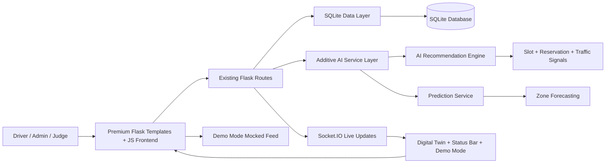

# Smart Parking Architecture Diagram

## Layer responsibilities
- Frontend: premium landing page, Digital Twin, AI Copilot, and status bar UI
- Existing backend: reservation, occupancy, history, analytics, and admin flows remain untouched
- AI service layer: recommendation scoring, confidence, and prediction payload generation
- Real-time layer: Socket.IO event broadcasts for live slot and reservation updates
- Demo mode: feeds the same interfaces with simulated data so the UI remains consistent

## New vs existing
- Existing: all original routes, database logic, and state transitions remain in place
- New additive layers: AI recommendation endpoint, prediction endpoint, smart city status bar, vision mode overlay, route preview, and live carousel-style demo behavior

## Release note
This is a backend-preserving architecture pass. The existing contract stays stable while the AI and real-time systems become additive and presentation-safe.
